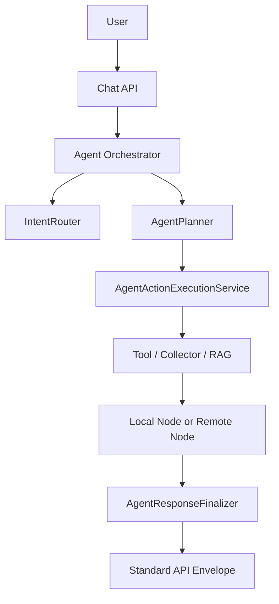

## Runtime Pipeline

## Responsibility Split

- `IntentRouter`: classify intent and pick strategy
- `AgentPlanner`: produce explicit plan
- `AgentActionExecutionService`: execute deterministic actions/tools
- `AgentConversationService`: session + context continuity
- `AgentResponseFinalizer`: normalize final response and metadata

## RAG Service Split

- decision service
- context/state service
- execution service
- structured data service
- prompt policy + feedback service

This avoids giant single-class behavior and reduces regression risk.

## Federation Boundary

- master node is planner/orchestrator
- child node is owner/executor for its domain
- ownership resolver decides route
- no chained child-to-child orchestration
