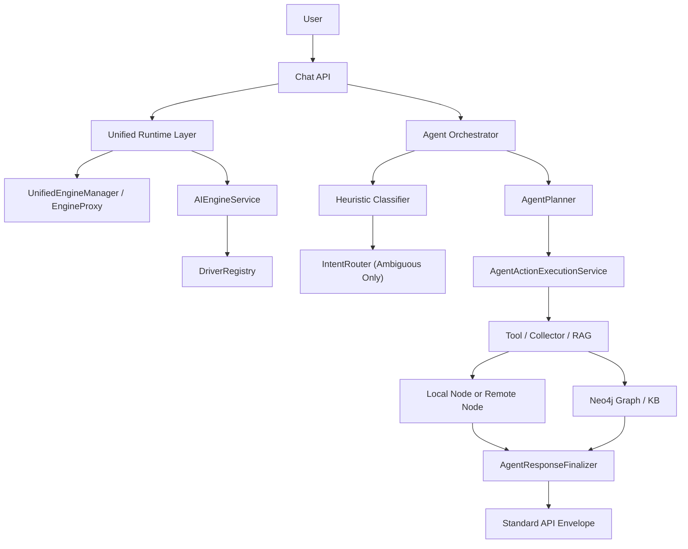

## Runtime Pipeline

## Responsibility Split

### Runtime APIs

- `UnifiedEngineManager`: public fluent entrypoint used by `Engine`, `AIEngine`, and `app('ai-engine')`
- `EngineProxy`: fluent per-request builder returned by `engine()` and `model()`
- `AIEngineService`: direct typed execution for `AIRequest` flows
- `DriverRegistry`: single source of truth for driver resolution

The removed `AIEngineManager` and `EngineBuilder` are no longer part of the runtime architecture.

### Agent Runtime

- `IntentRouter`: classify intent and pick strategy
- `AgentPlanner`: produce explicit plan
- `AgentActionExecutionService`: execute deterministic actions/tools
- `AgentConversationService`: session + context continuity
- `AgentResponseFinalizer`: normalize final response and metadata

Normal routing now prefers deterministic classification first:

- plain chat stays conversational
- semantic data questions go to graph/vector retrieval
- explicit list/count/filter requests go to structured execution
- AI routing is narrowed to ambiguous cases

## RAG Service Split

- decision service
- context/state service
- execution service
- structured data service
- prompt policy + feedback service

This avoids giant single-class behavior and reduces regression risk.

## Federation Boundary

- master node is planner/orchestrator
- child node is owner/executor for its domain
- ownership resolver decides route
- no chained child-to-child orchestration

## Central Graph Read Model

- Neo4j is the preferred read path when `graph.reads_prefer_central_graph=true`
- child apps still own transactional writes
- graph sync publishes entities, chunks, access scope, and relations
- retrieval returns `entity_ref` + `object` payloads for follow-up reuse

## Knowledge Base Layer

- graph truth stays in Neo4j
- the knowledge base is a scoped acceleration layer
- it caches plans, retrieval results, query profiles, and hot entity snapshots
- invalidation is tied to graph version and access version changes

## Practical Rule

- use `UnifiedEngineManager` when you want fluent `engine()->model()->generate(...)` style calls
- use `AIEngineService` when you already have an `AIRequest` and want direct typed execution
- mock `DriverRegistry` in tests when validating service behavior without real provider clients
