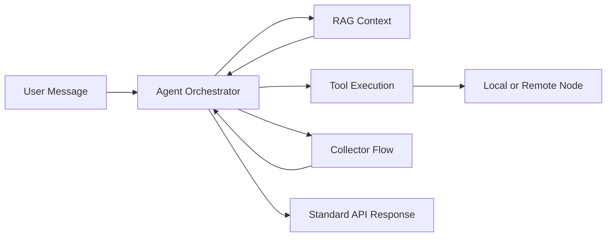

## Core Building Blocks

### Agent

The orchestration layer that decides what to do next.

Responsibilities:

- analyze user intent
- pick a tool or response strategy
- keep session continuity
- finalize safe, normalized responses

### Tool

A deterministic business operation callable by the agent.

Examples:

- list invoices
- create chart of account
- update customer status

Tools are the execution boundary for side effects.

### Collector

A multi-step data collection flow for incomplete inputs.

Collector modes:

- guided collector: strict field schema (`DataCollectorConfig`)
- autonomous collector: goal + tools + output schema (`AutonomousCollectorConfig`)

Use guided mode when required fields are known in advance.
Use autonomous mode when AI needs freedom to discover data through tools.

### RAG

Retrieval layer for:

- collection/model discovery
- context lookup
- structured data responses

### Node

A Laravel app in federation.

- master node orchestrates
- child node owns specific collections/tools and executes locally

## How They Work Together

## Rule of Thumb

- Use **tool** when action is clearly defined.
- Use **guided collector** for strict forms and validations.
- Use **autonomous collector** for open-ended create/update flows.
- Use **RAG** when answering or narrowing from available data.
- Use **node routing** when ownership is remote.
