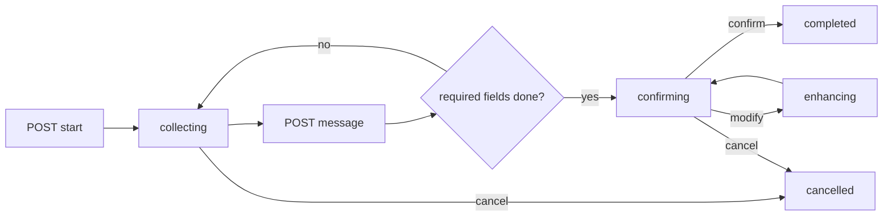

## What You Have

The package ships with two collector modes:

- `DataCollectorConfig` + `DataCollectorService`: field-first guided collection.
- `AutonomousCollectorConfig` + `AutonomousCollectorSessionService`: goal-first autonomous collection with tools.

Use guided collector when you know the exact fields you need. Use autonomous collector when the AI needs more freedom to discover and assemble structured output.

For full production examples, see `guides/data-collector-recipes`.

## Core Types

### Guided Collector (`DataCollectorConfig`)

Define a strict field schema and optional completion callbacks:

```php
use LaravelAIEngine\DTOs\DataCollectorConfig;

$config = new DataCollectorConfig(
    name: 'invoice_create',
    title: 'Create Invoice',
    description: 'Collect customer, issue date, and items',
    fields: [
        'customer_name' => 'Customer full name | required | min:2 | max:255',
        'issue_date' => 'Invoice date | required | date',
        'items_count' => 'Number of items | required | numeric | min:1',
        'notes' => [
            'type' => 'text',
            'description' => 'Additional notes',
            'required' => false,
        ],
    ],
    onCompleteAction: \App\Actions\CreateInvoiceFromCollectedData::class,
    confirmBeforeComplete: true,
    allowEnhancement: true,
    allowSkipOptional: true,
    locale: 'en',
    detectLocale: true,
);
```

Field definitions support:

- short syntax (`"Description | required | min:3"`)
- object syntax (`type`, `description`, `validation`, `required`, `options`, `examples`, `order`)

### Autonomous Collector (`AutonomousCollectorConfig`)

Define goal, tools, and output schema. AI drives the flow:

```php
use LaravelAIEngine\DTOs\AutonomousCollectorConfig;

$config = new AutonomousCollectorConfig(
    name: 'invoice',
    goal: 'Create a sales invoice',
    description: 'Collect customer and invoice items, then create invoice record',
    tools: [
        'find_customer' => [
            'description' => 'Search customer by name or email',
            'parameters' => ['query' => 'string|required'],
            'handler' => fn (array $args) => \App\Models\Customer::query()
                ->where('name', 'like', '%' . ($args['query'] ?? '') . '%')
                ->limit(10)
                ->get(),
        ],
    ],
    outputSchema: [
        'customer_id' => 'integer|required',
        'items' => [
            'type' => 'array',
            'items' => [
                'product_id' => 'integer|required',
                'quantity' => 'integer|required|min:1',
                'price' => 'numeric|required',
            ],
        ],
    ],
    onComplete: fn (array $payload) => \App\Models\Invoice::create($payload),
    confirmBeforeComplete: true,
);
```

## Guided Collector Lifecycle



State values are persisted in cache (`data_collector_state_{sessionId}`) and exposed as:

- `collecting`
- `confirming`
- `enhancing`
- `completed`
- `cancelled`

## Guided Collector API (v1)

Base routes from `routes/api.php`:

- `POST /api/v1/data-collector/start`
- `POST /api/v1/data-collector/start-custom`
- `POST /api/v1/data-collector/message`
- `GET /api/v1/data-collector/status/{sessionId}`
- `POST /api/v1/data-collector/cancel`
- `GET /api/v1/data-collector/data/{sessionId}`
- `POST /api/v1/data-collector/analyze-file`
- `POST /api/v1/data-collector/apply-extracted`

Typical flow:

```bash
# 1) Start with a registered config
curl -X POST http://localhost/api/v1/data-collector/start \
  -H "Content-Type: application/json" \
  -d '{"config_name":"invoice_create","session_id":"dc-1001"}'

# 2) Continue conversation
curl -X POST http://localhost/api/v1/data-collector/message \
  -H "Content-Type: application/json" \
  -d '{"session_id":"dc-1001","message":"Customer is ACME LLC"}'

# 3) Check current state
curl http://localhost/api/v1/data-collector/status/dc-1001
```

If `AI_ENGINE_STANDARDIZE_API_RESPONSES=true`, responses are wrapped in the standard envelope.

For `POST /start-custom`, `fields` can be sent as either:

- associative map (`"customer_name" => ...`) for backend-defined payloads
- indexed list (`[{ "name": "customer_name", ... }]`) for UI/Swagger-style payload builders

## Blade Component Alignment

The `data-collector` Blade component now supports both modes:

- guided (default): `apiEndpoint="/api/v1/data-collector"` and `collectorMode="guided"`
- autonomous: `apiEndpoint="/api/v1/autonomous-collector"` and `collectorMode="autonomous"`

It also normalizes standard API envelope responses.

## Autonomous Collector API (v1)

Base routes:

- `POST /api/v1/autonomous-collector/start`
- `POST /api/v1/autonomous-collector/message`
- `GET /api/v1/autonomous-collector/status/{sessionId}`
- `POST /api/v1/autonomous-collector/confirm`
- `POST /api/v1/autonomous-collector/cancel`
- `GET /api/v1/autonomous-collector/data/{sessionId}`

Use this API when the autonomous config is already registered by name and AI should drive the multi-step flow with tools.

## File-Assisted Collection

Use file extraction endpoints for invoices/forms uploaded by users:

- `POST /api/v1/data-collector/analyze-file`
  - supports `pdf`, `txt`, `doc`, `docx`
  - extracts text and asks AI to map values to fields
- `POST /api/v1/data-collector/apply-extracted`
  - writes extracted data into session state
  - pushes flow to confirmation phase

This is useful when users send a document and expect pre-filled fields before manual edits.

## Autonomous Collector Discovery and Registration

For automatic registration, implement `DiscoverableAutonomousCollector`:

```php
<?php

namespace App\AI\Configs;

use LaravelAIEngine\Contracts\DiscoverableAutonomousCollector;
use LaravelAIEngine\DTOs\AutonomousCollectorConfig;

class InvoiceCollector implements DiscoverableAutonomousCollector
{
    public static function getName(): string { return 'invoice'; }
    public static function getDescription(): string { return 'Create invoices with customer + items'; }
    public static function getPriority(): int { return 50; }
    public static function getModelClass(): ?string { return \App\Models\Invoice::class; }
    public static function getFilterConfig(): array { return ['date_field' => 'issue_date']; }
    public static function getAllowedOperations(?int $userId): array { return ['create', 'list']; }

    public static function getConfig(): AutonomousCollectorConfig
    {
        return new AutonomousCollectorConfig(
            name: 'invoice',
            goal: 'Create a sales invoice',
            description: 'Collect all information required for invoice creation',
            tools: [],
            outputSchema: ['customer_id' => 'integer|required'],
        );
    }
}
```

Discovery sources:

- `app/AI/Configs`
- `app/AI/Collectors`
- optional `ai-engine.autonomous_collector.discovery_paths`
- agent manifest (`app/AI/agent-manifest.php`) when configured

Useful commands:

```bash
php artisan ai:autonomous-collectors --discover
php artisan ai:autonomous-collectors --discover --local-only
php artisan ai:autonomous-collectors --discover --remote-only
php artisan ai:clear-discovery-cache --warm
php artisan ai:warm-discovery-cache --force
```

## Federation Behavior

Remote nodes advertise autonomous collectors through node `manifest` and `health` sync metadata.

- Local collector configs execute in-process.
- Remote collector metadata is used for routing decisions across nodes.
- Run `php artisan ai:node-ping --all` and `php artisan ai:autonomous-collectors --nodes` to verify visibility.

## Testing Playbook

```bash
# interactive guided collector test
php artisan ai:test-data-collector --preset=course --engine=openai --model=gpt-4o

# discover and list autonomous collectors
php artisan ai:autonomous-collectors --discover --nodes
```

For API tests, cover this minimum matrix:

- start -> message -> confirm -> completed
- start -> cancel
- start-custom with inline `fields`
- analyze-file + apply-extracted
- missing config/session (404 paths)

## Important Limits and Recommendations

- Guided collector embeds config into session state, so inline `start-custom` flows survive request boundaries.
- Autonomous collector serializes config metadata into cache, but closure handlers are not serializable. Keep long-running sessions tied to registered configs by stable `name` and boot-time registration.
- Keep tool handlers deterministic and side-effect safe. Use explicit `onComplete` for final mutation.
- Prefer locale resources and prompt templates over hardcoded language in your custom collector prompts.
