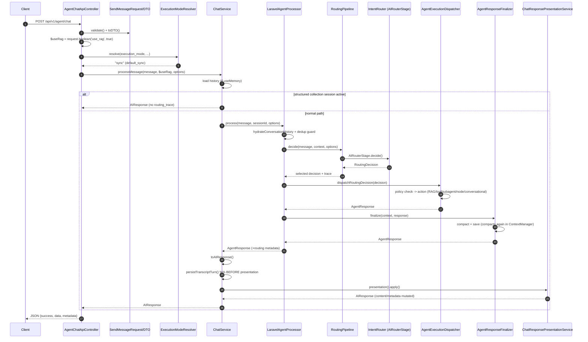

# Chat & Agentic Flow — Trace & Findings

## 1. End-to-end flow narrative

This walks a single synchronous chat request from the HTTP edge to the JSON response, naming the real classes at each hop.

### HTTP boundary → execution-mode resolution
1. **`POST /api/v1/agent/chat`** lands in `src/Http/Controllers/Api/AgentChatApiController.php`. The request is validated by `src/Http/Requests/SendMessageRequest.php` (`rules()` at line 38), which builds a `SendMessageDTO` (`src/DTOs/SendMessageDTO.php`) via `toDTO()` (mapping `rag` → `intelligentRag` at `SendMessageRequest.php:154`).
2. The controller reads RAG enablement *directly* from the raw request — `$useRag = $request->boolean('use_rag', true)` (`AgentChatApiController.php:35`) — **not** from the DTO. (This is the source of several confirmed bugs; see §4.)
3. RAG collections are resolved via `resolveRagCollections()` (`AgentChatApiController.php:127-142`). In node *routing* mode this returns `[]` by design.
4. Execution mode is resolved by `src/Services/Agent/AgentChatExecutionModeResolver.php`. Key behavior (verified intended): a **null** `execution_mode` returns `sync` early (`resolver.php:37-38`, `reason=default_sync`); only an explicit `execution_mode=auto` runs the auto-detection checks (goal/sub-agent, streaming, structured collections, skill match) at lines 41-63. Skill matching is done by `matchesSkill()` (lines 80-87), which swallows all exceptions.

### Sync path → ChatService
5. For the sync path the controller calls into `src/Services/ChatService.php` (`processMessage()`), passing `$useRag` (lines 57, 72).
6. `ChatService` resolves the conversation. When `useMemory=true`, it loads prior turns (lines 62-74) and threads a `conversationId`; when `useMemory=false`, `conversationId` stays null and `conversation_history` stays `[]`.
7. **Structured-collection short-circuit:** if an active structured-collection session matches, `StructuredCollectionSessionService` returns an `AIResponse` and `ChatService` returns it directly (lines 90-99), bypassing the routing pipeline.
8. Otherwise `ChatService` builds runtime options via `buildRuntimeOptions()` (lines 119-142, including `conversation_history` and `is_forwarded`) and invokes the agent runtime (`process()` at line 108).

### Runtime → routing pipeline → dispatcher → action
9. The runtime is `src/Services/Agent/Runtime/LaravelAgentProcessor.php`. It loads/creates the `UnifiedActionContext` (`getOrCreate`), hydrates conversation history (`hydrateConversationHistory()`, lines 173-219) and dedup-guards the current user turn (lines 76-83).
10. If the context is mid-session against a remote node (`routed_to_node`), it tries `CONTINUE_NODE` and may fall back to local RAG (lines 112-140).
11. Otherwise it routes through `routeThroughPipeline()` (lines 269-313), merging conversation signals via `src/Services/Agent/RoutingContextResolver.php` (`mergeConversationContext()`, lines 43-67), then running `src/Services/Agent/Routing/RoutingPipeline.php` (`decide()`, lines 30-67).
12. The pipeline runs ordered stages (`ActiveRunContinuation`, `ExplicitMode`, `SelectionReference`, `AgentSkillMatch`, `MessageClassification`, `AIRouter`, `FallbackConversational`). `AIRouterStage` (`src/Services/Agent/Routing/Stages/AIRouterStage.php:26-46`) delegates to `src/Services/Agent/IntentRouter.php` (`route()`, with `enforceForwardedRequestPolicy()` at 228-239). `FallbackConversationalStage` always returns a high-confidence `CONVERSATIONAL` decision, so the pipeline normally always selects.
13. If the pipeline throws, `routeThroughPipeline()` catches at line 305 and falls back to `heuristicRoute()` (line 311).
14. The selected `RoutingDecision` is dispatched by `dispatchRoutingDecision()` (`LaravelAgentProcessor.php:457-463`), which attaches `routing_decision`, `routing_trace`, and `route_explanation` to the response metadata, and calls `src/Services/Agent/Execution/AgentExecutionDispatcher.php` (`dispatch()`).
15. The dispatcher routes to the concrete action: `executeSearchRag()`, `executeTool()`, `executeSubAgent()`, `executeRouteToNode()`, or conversational generation (`AgentConversationService::executeConversational`, which calls `$this->ai->generate()`). Policy checks short-circuit with `AgentResponse::failure()` (lines 134-139, 160-165, 210-216, 282-287). Tool execution goes through `src/Services/Agent/AgentActionExecutionService.php` (`executeUseTool()`, with RAG fallback at 150-168). Audit/streaming events are emitted via `recordExecutionAudit()` (lines 361-402).
16. The response is finalized by `src/Services/Agent/AgentResponseFinalizer.php` (`finalize()`, lines 47-55): it appends the assistant turn, clears stale `selected_entity_context` (conditionally), compacts via `ConversationContextCompactor`, and saves through `src/Services/Agent/ContextManager.php` (`save()`, which compacts *again* at line 62).

### Response presentation & persistence
17. Back in `ChatService`, the agent response is converted to `AIResponse` via `toAIResponse()` (lines ~108-112, threading `conversationId`).
18. **Order of operations (buggy):** `persistTranscriptTurn()` saves the response (line 113) **before** `presentation()->apply()` (line 114) — `src/Services/Agent/ChatResponsePresentationService.php` extracts response points/suggestions and may rewrite `content` (lines 24-33). The persisted transcript therefore diverges from the returned response.
19. The controller serializes the final `AIResponse` to JSON (`AgentChatApiController.php:82-106`).

### How async (durable run) diverges
When `execution_mode=auto` resolves to async, work is queued as a durable run executed by `src/Jobs/RunAgentJob.php`. It claims idempotency (`claimIdempotency`, line 64/334), takes a run lock (`withRunLock`, line 69; `src/Services/Agent/AgentRunSafetyService.php`), checks budget once at start (`assertPolicyAllowsRun()`, lines 306-324), runs `$runtime->process()` (line 125), then finalizes/persists, emitting lifecycle events via `src/Services/Agent/AgentRunEventStreamService.php`. Steps are created via `src/Repositories/AgentRunStepRepository.php` (`nextSequence()`, lines 88-96). Approvals/resume go through `src/Services/Agent/AgentRunApprovalService.php`; stuck-run recovery through `src/Services/Agent/AgentRunMaintenanceService.php`; continuation via `ContinueAgentRunJob`.

### How streaming (SSE/broadcast) diverges
Streaming relies on `AgentRunEventStreamService::emit()` (lines 80-109): each event is **persisted first** to `run.metadata['events']` and `step.metadata['events']` (`appendEvent()`, lines 165-172, capped to last 200), **then** broadcast via `AgentRunStreamed` (`ShouldBroadcastNow`) and optionally pushed to a `$sink` callback. Clients consume via `src/Services/Agent/AgentRunSseStreamService.php`, a polling loop (lines 36-58) that re-reads `fallbackEvents()` and uses `eventsAfter($lastEventId)` for resume. Note: `AgentFinalResponseStreamingService` exists and is registered but is **never called from the runtime** — conversational replies use synchronous `generate()`.

## 2. Mermaid sequence diagram (sync chat turn)

## 3. Multi-turn behavior

**Stateless-history design.** The intended contract is that the client (or `ChatService`) supplies prior turns as `options['conversation_history']`, and the runtime hydrates them into the per-session `UnifiedActionContext`. `hydrateConversationHistory()` (`LaravelAgentProcessor.php:173-219`) normalizes/filters roles and hard-caps to the configured `max_messages`. A dedup guard (lines 76-83) compares the last hydrated message against the incoming message (trim + exact string equality) to avoid double-adding the current turn. Context is cached (24h TTL) and also reconstructable from durable agent runs via `ContextManager::restoreFromAgentRuns()`. Older turns are compacted into a summary by `ConversationContextCompactor` and durable facts are extracted into `ConversationMemoryRepository` for later lexical/semantic retrieval.

**Correctness concerns in this design:**
- **Early-return guard defeats fresh history on re-entrant/reroute turns.** `hydrateConversationHistory()` returns early when the context already has history (lines 175-177), so client-supplied updated history on a reroute is silently ignored. The workaround (stripping `conversation_history` before reroute in `AgentConversationService.php:79-83`) is fragile and caller-dependent. (High — §4.)
- **Dedup is brittle.** String-trim equality is vulnerable to whitespace/Unicode normalization differences (duplicate turns) and to whitespace-only messages collapsing to `''` (silently dropping a turn). There is no idempotency key. (See §4.)
- **History persistence can silently fail** (`persistTranscriptTurn`), so the next turn reloads stale history. (High — §4.)
- **Memory scope can carry across sessions.** `memoryScope()` derives `tenant_id`/`workspace_id` from cached `context.metadata`, which is never explicitly cleared, so memories can be written/retrieved under the wrong scope hash. (High — §4.)
- **Double compaction per turn** can corrupt the `pre_compaction_history_size_chars` metric. (Low — §4.)

## 4. Confirmed flow bugs (by severity)

### Critical
None confirmed.

### High

**H1 — `hydrateConversationHistory` early-return drops fresh history on reroutes.**
Re-entrant `process()` (RAG → orchestrator → tool) reuses the cached context, so the early-return at `LaravelAgentProcessor.php:175-177` ignores updated `conversation_history` passed in reroute options. Breaks rerouted turns that carry tool results.
*Fix:* `src/Services/Agent/Runtime/LaravelAgentProcessor.php:173-182` — only return early when no new history is supplied **and** context already has history; otherwise apply/merge the supplied history.

**H2 — `persistTranscriptTurn` swallows failures; client sees success on unpersisted turn.**
`ChatService.php:190-194` catches and only warns. Callers (lines 96, 113) continue, controller returns `success:true`. Next turn reloads stale history → silent multi-turn corruption.
*Fix:* return a boolean from `persistTranscriptTurn()`, surface it as `transcript_persisted` in `AIResponse` metadata, and decide fail-fast vs. warn at the callers.

**H3 — Memory extraction can store/retrieve under stale scope across sessions.**
`ConversationContextCompactor.php:264-273` (`memoryScope()`) reads `tenant_id`/`workspace_id` from cached `context.metadata`, never cleared on new session. Mismatched `scope_hash` silently returns no memories (`ConversationMemoryRepository.php:125-128`).
*Fix:* pass `tenant_id`/`workspace_id` as explicit params from the current request to `memoryScope()` (or stop caching them in `context.metadata` and require them fresh per request).

**H4 — `nextSequence()` race allows duplicate step sequence numbers.**
`AgentRunStepRepository.php:88-96` uses `max('sequence') + 1` with no lock. The main job path is protected by `withRunLock`, but **unprotected callers exist** (`AgentRunRecoveryService::replayFailedStep`, runtime-control cancellation steps), so concurrent creates collide; the `unique(run_id,sequence)` constraint then crashes the op rather than preventing it.
*Fix:* make it atomic — `lockForUpdate()` inside a transaction, or a raw `MAX(...)+1` insert; also wrap the recovery/control creates in `withRunLock`.

**H5 — Lock TTL (60s) < job timeout (300s) → concurrent run execution.**
`AgentRunSafetyService.php:193-199` defaults `lock_ttl_seconds=60`; `RunAgentJob.php:45` timeout is 300s. A job hung >60s loses the lock; a retry enters the same run concurrently, producing duplicate steps and corrupt state.
*Fix:* set default `lock_ttl_seconds >= timeout` (e.g. `max(300, timeout+60)`), or refresh the lock during long operations.

**H6 — Unused DTO `intelligentRag` + unvalidated `use_rag`.**
`SendMessageRequest.php:38` validates `rag` → `SendMessageDTO.intelligentRag` (`:154`), but the controller reads unvalidated `use_rag` (`AgentChatApiController.php:35`) and never reads `intelligentRag`. Defaults conflict (`rag`→false, `use_rag`→true). The validated field is dead; RAG control bypasses validation.
*Fix:* validate `use_rag` in `rules()` and read the validated value, or rename the DTO field to `useRag` and use it consistently throughout (then drop `rag`).

**H7 — `AIRouterStage` lets `IntentRouter::route()` exceptions crash the pipeline.**
`AIRouterStage.php:26-46` calls `intentRouter->route()` with no try/catch; `RoutingPipeline.php:35-58` doesn't guard stage exceptions either. A throw aborts the whole pipeline (losing all prior stage decisions from the trace), caught only at `LaravelAgentProcessor.php:305` → `heuristicRoute()`. Callers can't tell "AI abstained" from "AI crashed."
*Fix:* wrap `route()` in try/catch in `AIRouterStage`, log, and `return null` to abstain so later stages still run and the trace is preserved.

### Medium

**M1 — Presentation runs after persistence; stored ≠ returned response.**
`ChatService.php:113-114`: `persistTranscriptTurn()` saves the pre-presentation response; `presentation()->apply()` then rewrites content (`array` format strips points) and enriches metadata. Transcript readers get different content/metadata than the original client.
*Fix:* apply presentation **before** persistence — swap lines 113/114.

**M2 — Structured-collection short-circuit returns no routing trace.**
`ChatService.php:90-99` returns the `StructuredCollectionSessionService` `AIResponse` directly with only `collection` metadata. Docs (`chat-flow.mdx:282`) say a missing `routing_trace` on a sync response is a regression.
*Fix:* attach a synthetic `routing_decision`/`routing_trace`/`route_explanation` (`action: structured_collection`) before returning.

**M3 — Routing metadata overwritten on nested dispatch.**
`LaravelAgentProcessor.php:457-462` `array_merge`-overwrites `routing_decision`/`routing_trace`. When a SEARCH_RAG dispatch reroutes through a nested `process()`/`dispatchRoutingDecision()`, the inner decision is replaced by the outer one — audit trail loss.
*Fix:* detect existing `routing_trace` in `$response->metadata` and prepend/merge rather than overwrite; preserve the nested decision (e.g. `nested_routing_decision`).

**M4 — Policy blocks return bare failures with no decision trace.**
`AgentExecutionDispatcher.php:134-139, 160-165, 210-216, 282-287` return `AgentResponse::failure(message, context)` before reaching metadata enrichment and before `recordExecutionAudit()`. Clients can't distinguish policy denial from genuine failure; no audit row.
*Fix:* extend `AgentResponse::failure()` to accept metadata; pass `policy_blocked`, `blocked_type`, `blocked_resource`; log a warning per block.

**M5 — `selected_entity_context` only cleared on success.**
`AgentResponseFinalizer.php:47-51` unsets `selected_entity_context` only when the response carries `entity_ids`. A failed selection leaves stale entity context in the saved context, biasing the next turn.
*Fix:* unconditionally `unset($context->metadata['selected_entity_context'])` in `finalize()`.

**M6 — Skipped-stages metadata lost on full-abstention fallback.**
`RoutingPipeline.php:60-66` attaches `skipped_stages` only when a non-abstention is found. If all stages abstain (non-default config), `LaravelAgentProcessor.php:281` synthesizes a fallback `RoutingDecision` with no `skipped_stages`, losing observability.
*Fix:* populate the fallback decision's metadata from the trace (helper that maps `trace->decisions` to skipped-stage entries).

**M7 — Backward fallback selection ignores confidence.**
`RoutingPipeline.php:60-64` reverse-iterates and selects the first non-abstention regardless of confidence, unlike the forward loop which requires `confidence==='high'`. Latent today (all stages are high/abstain), but a future medium/low stage could be wrongly chosen over a later high-confidence decision.
*Fix:* first backward pass for high-confidence non-abstention, then a second pass for any non-abstention.

**M8 — Node-continuation→RAG fallback drops the CONTINUE_NODE trace.**
`LaravelAgentProcessor.php:112-140`: on continuation failure, `searchRag()` builds a fresh SEARCH_RAG decision (lines 405-410) with no record that CONTINUE_NODE was attempted/failed.
*Fix:* build a trace containing the failed CONTINUE_NODE decision and pass it through to `dispatchRoutingDecision()` for the fallback.

**M9 — Reroute callback doesn't propagate decision context.**
`AgentConversationService.php:71-86` strips `conversation_history` but doesn't carry `decision_source`/`decision_path`/`route_mode`. The re-entered `process()` re-classifies from scratch, overwriting the original RAG-origin decision source.
*Fix:* copy `decision_source`/`decision_path`/`preclassified_route_mode` from `context.metadata` into `rerouteOptions`.

**M10 — Tool-not-found silently falls back to RAG (non-structured path).**
`AgentActionExecutionService.php:150-168`: structured fallback tags `decision_source=tool_fallback` (lines 159-165) but the plain fallback (line 168) does not, so it's indistinguishable from a normal RAG search; user gets no tool-not-found signal.
*Fix:* on line 168, merge `['decision_path'=>'tool_fallback','decision_source'=>'tool_fallback']` into options.

**M11 — Dedup guard has no idempotency key (intentional retries silently dropped).**
`LaravelAgentProcessor.php:76-83`/`173-219`: a client resending the exact same message for retry is skipped via string equality, with no idempotency token.
*Fix:* accept an `idempotency_key` in options, cache the response by key, and use message-content dedup only as a fallback.

**M12 — `conversation_id` not propagated into runtime options/metadata.**
`ChatService::buildRuntimeOptions()` (119-142) omits `conversation_id`; the runtime, RAG context, and tool-run logging never see it (e.g. `LangGraphAgentRuntime` expects `options['conversation_id']`; `RAGContextService.build()` omits it). Telemetry inside the runtime can't trace back to the conversation.
*Fix:* add a `?string $conversationId` param to `buildRuntimeOptions()` and include `conversation_id` in options; add `conversation_id` to `RAGContextService.build()` output.

**M13 — Forwarded-request policy downgrade is unlogged.**
`IntentRouter.php:228-239` rewrites `route_to_node` → `search_rag` for forwarded requests, only appending to `reasoning`; `decision_source` remains `router_ai`, masking the policy override.
*Fix:* log a warning and set a `policy_enforced`/`original_action` metadata flag.

**M14 — Message truncation in context not surfaced to client.**
`UnifiedActionContext.php:30-63`: messages over the limit (default 2000) are silently truncated with `...`; no flag/metadata. Subsequent turns operate on truncated history.
*Fix:* track truncation per entry (`is_truncated`) and add `truncation_warnings` to context metadata.

**M15 — Memory extraction prompt lacks locale/language context.**
`ConversationMemoryExtractor.php:126-147` is English-only with an aspirational "any language" instruction; `extractWithAi()` has scope but doesn't pass locale to `prompt()`.
*Fix:* pass scope/locale into `prompt()` and inject a locale hint; include `locale` (e.g. `app()->getLocale()`) in `memoryScope()`.

**M16 — `restoreFromAgentRuns` skips runs with no `final_response`.**
`ContextManager.php:97-135` filters `whereNotNull('final_response')` (line 104). Failed/in-flight runs (which never set `final_response`) are skipped, so recent activity can yield empty restored history.
*Fix:* drop the `whereNotNull('final_response')` filter; build history from `input['message']` even when no final response exists, null-guarding the `final_response` access.

**M17 — Memory lexical scoring ignores recency.**
`ConversationMemoryRepository.php:151-164` scores lexical overlap + confidence only; recency only affects ordering, not score. A 6-month-old memory can tie a fresh one.
*Fix:* add a recency-decay term (`exp(-age/ttl)`) into `score()`, weighting per the design plan (lexical 0.55 / confidence 0.25 / recency 0.10 / +0.10).

**M18 — Approval resume leaves the approved step in PENDING (orphaned).**
`AgentRunApprovalService.php:120-137`: `resumeApprovedStep()` transitions the approved step to `STATUS_PENDING` while a new `continuation` step is created later → the approved step is orphaned looking executable.
*Fix:* transition the approved step to `STATUS_COMPLETED` (update the corresponding lifecycle test assertion).

**M19 — Runtime budget is checked only at job start, never during execution.**
`RunAgentJob.php:306-324` checks estimated tokens/cost once; the `AgentRunBudgetService` accumulation/usage methods (39-101) are never called during `process()` (line 125). Actual consumption is unbounded.
*Fix:* `startAccumulatingCredits()` before process, `assertRuntimeBudgetAllows()` mid/after, `finishAccumulatingCredits()` + `recordRunUsage()` on completion, and finish in the catch block to avoid accumulator leaks.

**M20 — Stuck-run recovery emits no event / step / final_response.**
`AgentRunMaintenanceService.php:12-45` directly sets `STATUS_FAILED` (lines 31-35) without a `RUN_FAILED` event, recovery step, recovery metadata, or `final_response` — subscribers never learn the run was auto-failed.
*Fix:* emit `RUN_FAILED`, append a recovery event to metadata, and set a `final_response` describing the auto-fail.

**M21 — Sink callback exception after partial commit leaves inconsistent state.**
`AgentRunEventStreamService.php:104-106`: `$sink($event)` is not wrapped; events are already persisted (95, 99) and broadcast (102), but an exception aborts the streaming generator mid-response.
*Fix:* wrap the sink call in try/catch, log, and do not re-throw (the event is already persisted).

**M22 — SSE terminal-status check can break before final events persist.**
`AgentRunSseStreamService.php:36-58`: the loop breaks on `isTerminal()` without a final event re-fetch; the `RUN_COMPLETED` event persisted in the transition window can be missed (`fallbackEvents` reads from metadata).
*Fix:* after detecting terminal status, do one final `eventsAfter()` fetch/emit before breaking.

### Low

**L1 — Skill matching swallows exceptions silently.**
`AgentChatExecutionModeResolver.php:80-87` — empty `catch (\Throwable)` returns false with no logging. Safe fallback, but skill-match failures are invisible.
*Fix:* log to `ai-engine` channel in the catch (consistent with `AgentSkillMatcher::matchIntent`).

**L2 — Routing mode silently drops RAG collections.**
`AgentChatApiController.php:127-142` returns `[]` in node routing mode by design but without logging, confusing developers seeing empty RAG context.
*Fix:* add a debug log explaining routing-mode disables centralized collection discovery.

**L3 — No memory-status metadata when memory disabled.**
`ChatService.php:62-74, 140`: when `useMemory=false`, history is empty and the response carries no flag distinguishing "memory off" vs "no history" vs "load failed."
*Fix:* add `memory_enabled`/`conversation_history_count` to `toAIResponse()` metadata.

**L4 — `conversation_id` missing from runtime response metadata.** (Closely related to M12.)
`ChatService.php:108-112` threads `conversationId` only into the top-level property, not metadata, so runtime-internal logging can't reference it.
*Fix:* include `conversation_id` in `toAIResponse()` metadata.

**L5 — `RoutingContextResolver` merge isn't idempotent across fallback.**
`RoutingContextResolver.php:43-67` only sets keys if unset; a `selected_entity` merged during a failed pipeline attempt persists into `heuristicRoute()` (`LaravelAgentProcessor.php:305-341`), biasing fallback routing (affects `shouldUseRagPipeline`).
*Fix:* `unset($options['selected_entity'], $options['selected_entity_context'])` before calling `heuristicRoute()` in the catch block.

**L6 — Dedup guard mishandles whitespace-only messages.**
`LaravelAgentProcessor.php:76-83`: a whitespace-only message trims to `''` and can match a prior empty user turn, silently dropping the current turn.
*Fix:* require `$trimmedLast !== ''` in the `$alreadyPresent` condition.

**L7 — Double context compaction per turn corrupts metrics.**
`AgentResponseFinalizer.php:54-55` compacts then `ContextManager::save()` compacts again (`ContextManager.php:62`). The second call early-returns from re-compaction but still calls `storeMetrics()`, overwriting `pre_compaction_history_size_chars` with the post-compaction size.
*Fix:* remove the redundant `compact()` from `ContextManager::save()` (callers already compact), or add an idempotency guard.

**L8 — `emitted_at` set at event creation, not DB insert.**
`AgentRunEventStreamService.php:155` stamps PHP time at `makeEvent()`. Under high event rates the stamp can diverge from insert order; combined with the unguarded RMW in `appendEvent()` (165-172) this is really an event-loss risk (see L11).
*Fix:* make `appendEvent()` atomic (lockForUpdate / separate events table); ordering follows from that.

**L9 — Run/step metadata updates not atomic.**
`AgentRunEventStreamService.php:94-100` performs two independent `appendEvent()` → `update()` calls without a transaction. (No optimistic locking exists, so the original "version-check fail" framing is inaccurate; the real gap is no transaction.)
*Fix:* wrap both `appendEvent()` calls in `DB::transaction()`.

**L10 — Event metadata silently truncated to last 200.**
`AgentRunEventStreamService.php:169-170` `array_slice($events, -$limit)` with no logging; a 250+ event turn loses the oldest, and SSE resume with a truncated `last_event_id` returns nothing.
*Fix:* log a warning when truncating; warn when `eventsAfter()` can't find `last_event_id`; document/raise the limit and treat broadcast (not metadata) as primary.

**L11 — Unguarded read-modify-write in `appendEvent()`.**
`AgentRunEventStreamService.php:165-172` reads `metadata`, appends, writes back with no locking/atomicity. Mitigated today by `withRunLock` in the main job path, but `AgentRunRecoveryService::appendRecoveryEvent` does the same RMW outside the lock.
*Fix:* atomic update (lockForUpdate or dedicated `ai_agent_run_events` table); or document/enforce that `appendEvent()` runs inside `withRunLock`.

**L12 — Registry tools don't receive selected-entity binding.**
`AgentActionExecutionService.php:85-91` binds entity context for model-config tools but `executeRegistryTool()` (179-227) doesn't — asymmetric behavior. (The original "binding happens after selection" framing is wrong; placement is correct.)
*Fix:* in `executeRegistryTool()`, after extracting params and before validation, call `selectedEntityContext->bindToToolParams(...)`.

**L13 — Node-fallback response not marked degraded in metadata.**
`AgentExecutionDispatcher.php:295-312` prepends a fallback notice to the message but sets no `fallback_mode` flag; clients must parse text to detect degraded mode.
*Fix:* set `fallback_mode=true`/`fallback_reason`/`original_resource` on `$fallback->metadata`.

**L14 — Presentation rewrites content without versioning.**
`ChatResponsePresentationService.php:24-33`: in `array` format the original formatted content is replaced and not retained on the `AIResponse` (only the transcript holds the pre-presentation copy).
*Fix:* store the original in metadata (`response_content_original`) before replacing, or default config to `both` when both forms are needed.

**L15 — Audit emit lacks error handling.**
`AgentExecutionDispatcher.php:361-402`: the optional-audit early-return (368-370) is intended, but `app(AgentRunEventStreamService::class)->emit()` (line 394) is unguarded; a failure halts tool execution.
*Fix:* wrap the `emit()` call in try/catch + warn.

**L16 — Step `completed_at` set for non-terminal waiting states.**
`RunAgentJob.php:157-202`: line 185 always sets step `completed_at=now()`, even for `WAITING_INPUT`/`WAITING_APPROVAL`, while the run keeps `completed_at=null`. A "steps where completed_at IS NOT NULL" query would wrongly include waiting steps.
*Fix:* set step `completed_at` only for terminal statuses.

**L17 — `AgentFinalResponseStreamingService` is dead code.**
Registered in `AgentCoreServiceRegistrar.php` but never called from runtime (only from a test); conversational replies use synchronous `generate()`.
*Fix:* either integrate token streaming into the conversational path or remove the service + registration + its test.

**L18 — No circuit breaker / idle-timeout on the SSE poll loop.**
`AgentRunSseStreamService.php:36`: a never-terminal run holds the connection for the full timeout (default 30s); many stuck clients pressure the worker pool.
*Fix:* add an inactivity timeout and `connection_aborted()` check for early exit; consider a concurrency gauge.

## 5. Dismissed claims (checked, not bugs)

- **Resolver "skips auto-mode when execution_mode is null."** Intended: null → `sync` (`default_sync`); only explicit `auto` runs detection (`resolver.php:37-38`; docs `chat-flow.mdx:64`).
- **"Inconsistent RAG default values" (`use_rag` true vs `intelligentRag` false) is a bug.** Dismissed as a values mismatch per se — the *real* confirmed issue is the unvalidated/dead-field plumbing (H6), not the defaults being different.
- **"Ambiguous execution-mode defaults in request parsing."** `toDTO()` (136-141) gives `execution_mode` precedence over the legacy `async` field via `??=`; tested and intentional.
- **"Silent fallback to CONVERSATIONAL when all stages abstain."** `FallbackConversationalStage` is always last and always returns high-confidence CONVERSATIONAL; the synthesized fallback is effectively dead code and is logged when hit.
- **"Silent metadata loss in `AgentResponse::toAIResponse()`."** `array_merge($this->metadata, [...])` preserves existing keys; `ChatService` uses its own `toAIResponse()` anyway.
- **"`restoreMissingDurableState` overwrites history / lacks null check."** Has an `instanceof` guard and only restores when cached history is empty (`===[]`). Restorative, not destructive.
- **"Semantic memory index not updated on `retrieved_memory` mutation."** That metadata key is audit/tracing only; the semantic index stores vectors, confidence lives in the DB. Separation is intentional.
- **"History hard-cap slice discards per-message metadata."** `array_slice` preserves keys within each element; only the count is trimmed, by design (older turns go to summary/persistent memory).
- **"`eventsAfter()` ID matching relies on unstable sort."** PHP 8.1+ stable sort + exact UUID string match make resume deterministic.
- **"Broadcast dispatch decoupled from persistence."** Persistence is synchronous and precedes broadcast; dual-guarantee (metadata fallback + broadcast) is the intended design.
- **"Idempotency lock not released on assertion failure."** `assertPolicyAllowsRun()` throws inside `withRunLock`, propagates to the outer catch which calls `releaseClaimedIdempotency()` before re-throwing (`RunAgentJob.php:64-142`).
- **"Idempotency key scope excludes run_id."** Scope includes `run_id` (`RunAgentJob.php:334`); proven by `AgentRunSafetyServiceTest`.
- **"Presentation can corrupt `routing_trace` after `enrichResponse`."** All metadata ops are `array_merge`/`withMetadata` that preserve existing keys; `routing_trace` survives.

## 6. Top fixes, ordered

1. **H5 — Set lock TTL ≥ job timeout** (`AgentRunSafetyService`/config). Highest blast radius: prevents concurrent execution of the same run.
2. **H4 — Make `nextSequence()` atomic** and lock the recovery/control step creates. Eliminates duplicate-sequence corruption.
3. **H2 — Surface `persistTranscriptTurn` failures** (return bool + `transcript_persisted` metadata). Stops silent multi-turn history corruption.
4. **H1 — Fix `hydrateConversationHistory` early-return** so reroutes get fresh history (removes the fragile strip-history workaround).
5. **H7 — Guard `IntentRouter::route()` in `AIRouterStage`** (catch → abstain). Prevents AI-engine failures from crashing the whole pipeline and losing the trace.
6. **H3 — Pass tenant/workspace scope explicitly to `memoryScope()`.** Stops cross-session memory mis-scoping.
7. **H6 — Validate `use_rag` / unify the RAG field.** Closes the validation gap and removes dead DTO code.
8. **M1 — Move presentation before persistence** so stored == returned response.
9. **M19 — Add runtime budget tracking** in `RunAgentJob` (currently unbounded).
10. **M4 — Tag policy-blocked responses** with metadata + audit log (distinguish denial from failure).
11. **M3 — Preserve nested routing trace** in `dispatchRoutingDecision()`.
12. **M16 — Stop dropping no-`final_response` runs** in `restoreFromAgentRuns`.
13. **L11/L9/L10 — Harden event streaming**: atomic `appendEvent`, transactional run+step updates, truncation logging. (Group, since they touch the same method.)
14. **M21/M22 — SSE robustness**: wrap the sink callback; final event fetch on terminal status.
15. Remaining mediums (M2, M5, M6, M7, M8, M9, M10, M11, M12, M13, M14, M15, M17, M18, M20) and lows as cleanup, batched by file (`LaravelAgentProcessor`, `RoutingPipeline`, `AgentExecutionDispatcher`, `ConversationContextCompactor`, `AgentRunEventStreamService`).