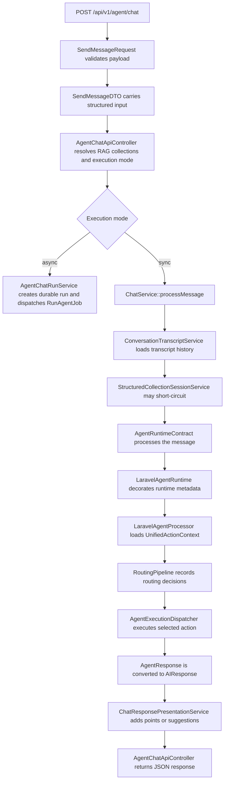
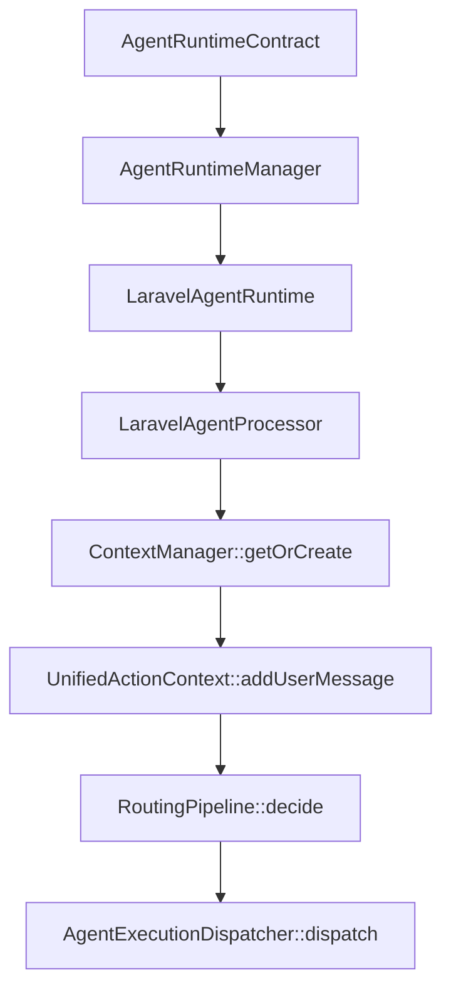
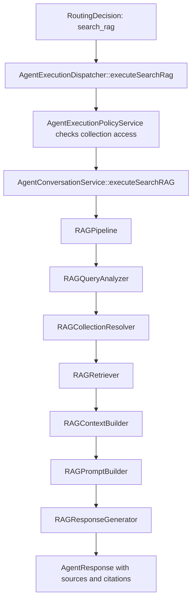

# ChatFlow Trace

ChatFlow is the package path behind `POST /api/v1/agent/chat` and `ChatService::processMessage()`. It validates the request, builds a structured chat DTO, resolves sync or async execution, delegates the turn to the configured agent runtime, records routing metadata, and returns a normalized API response.

Use this page when debugging a chat response, adding a routing stage, changing RAG behavior, or checking whether a new feature belongs in the controller, service, runtime, routing, dispatcher, or RAG layer.

## High-Level Flow



## Request Boundary

`SendMessageRequest` is the only HTTP validation boundary for the chat endpoint. It validates the public payload and creates `SendMessageDTO`.

Important request fields:

| Field | Purpose |
| --- | --- |
| `message` | User message. Required. |
| `session_id` | Conversation/session key. Required. |
| `engine` / `model` | Provider and model passed to the runtime. |
| `memory` | Enables transcript loading and persistence. |
| `actions` | Allows runtime actions/tools to be returned and executed. |
| `use_rag` | Enables RAG for the request. |
| `force_rag` | Forces the routing pipeline toward `search_rag`. |
| `rag_collections` | Restricts retrieval to selected collections. |
| `search_instructions` | Adds retrieval/generation instructions. |
| `execution_mode` | `sync`, `async`, or `auto`. |
| `async` | Legacy async flag or alias for `sync`, `async`, and `auto`. |
| `collection` | Structured collection schema and callback settings. |
| `response_points_format` | `text`, `array`, `both`, or `none`. |
| `response_suggestions` | Enables suggested next actions. |

Controllers should not query models directly. If a new request field needs business logic, convert it into DTO/options data in the request/controller boundary and handle the logic in a service.

## Execution Mode

`AgentChatExecutionModeResolver` decides whether the request is handled immediately or queued as a durable agent run.

| Requested state | Result |
| --- | --- |
| `execution_mode=sync` | Always sync, with reason `explicit_sync`. |
| Async disabled in config | Sync, with reason `async_disabled`. |
| `execution_mode=async` or `async=true` | Async, with reason `explicit_async`. |
| Config default async | Async, with reason `config_async_default`. |
| No explicit mode | Sync, with reason `default_sync`. |
| `execution_mode=auto` plus goal/sub-agent | Async, with reason `goal_or_sub_agent`. |
| `execution_mode=auto` plus streaming | Async, with reason `streaming`. |
| `execution_mode=auto` plus durable collection callback | Async, with reason `structured_collection`. |
| `execution_mode=auto` plus matched skill | Async, with reason `matched_skill`. |
| `execution_mode=auto` simple chat | Sync, with reason `simple_chat`. |

Async responses return `202 Accepted` with `agent_run_id`, `status_url`, `trace_url`, `stream_url`, and broadcast metadata. Sync responses return the final chat response.

## Sync Chat Service Flow

`ChatService::processMessage()` owns the synchronous business flow.

1. Loads or creates the transcript conversation when `memory=true`.
2. Loads recent transcript history unless history is already provided.
3. Fires `AISessionStarted`.
4. Builds runtime options from engine, model, memory, actions, RAG, collections, search instructions, conversation history, forwarded-request state, and controller execution metadata.
5. Calls `StructuredCollectionSessionService::handle()`.
6. If collection handling returns an `AIResponse`, it short-circuits before the agent runtime.
7. Otherwise delegates to `AgentRuntimeContract`.
8. Converts the returned `AgentResponse` into `AIResponse`.
9. Persists the transcript turn when memory is enabled.
10. Applies response presentation for structured points and suggestions.

Runtime options are the contract between the controller/service boundary and agent runtime. Prefer adding generic options there instead of passing request objects deeper into the runtime.

## Runtime And Routing

The default runtime path is:



`LaravelAgentProcessor` is responsible for context and routing. It should not execute RAG, tools, nodes, or sub-agents directly. It creates a `RoutingDecision`, then passes it to `AgentExecutionDispatcher`.

`RoutingPipeline` records every stage decision in a `RoutingTrace`. The default stage order is:

1. `ActiveRunContinuationStage`
2. `ExplicitModeStage`
3. `SelectionReferenceStage`
4. `AgentSkillMatchStage`
5. `MessageClassificationStage`
6. `AIRouterStage`
7. `FallbackConversationalStage`

Stages may return `null` to abstain. The pipeline stops on the first high-confidence non-abstention and stores earlier skipped stages in `metadata.skipped_stages`.

## Routing Decision Actions

| Action | Executor responsibility |
| --- | --- |
| `conversational` | Generate a normal assistant response. |
| `search_rag` | Execute the RAG pipeline. |
| `handle_selection` | Resolve numbered options or positional references. |
| `use_tool` | Execute an application/provider tool through policy checks. |
| `run_sub_agent` | Execute goal/sub-agent orchestration. |
| `route_to_node` | Forward to a configured remote node. |
| `continue_node` | Continue an active routed node session. |
| `need_user_input` | Return structured required input metadata. |
| `fail` | Return a controlled failure response. |

Routing stages decide only. Side effects, authorization checks, RAG retrieval, tool execution, remote node calls, and sub-agent execution belong behind `AgentExecutionDispatcher` and its downstream services.

## Response Metadata

A successful sync response includes the rendered `data.response` plus normalized metadata.

```json
{
  "success": true,
  "data": {
    "response": "Found 2 relevant records.",
    "metadata": {
      "agent_runtime": "laravel",
      "routing_decision": {
        "action": "search_rag",
        "source": "explicit",
        "confidence": "high",
        "reason": "Request explicitly forced RAG.",
        "payload": [],
        "metadata": {"stage": "explicit_mode"}
      },
      "routing_trace": [
        {
          "action": "abstain",
          "source": "active_run_continuation",
          "confidence": "none",
          "reason": "Stage did not match.",
          "payload": [],
          "metadata": []
        },
        {
          "action": "search_rag",
          "source": "explicit",
          "confidence": "high",
          "reason": "Request explicitly forced RAG.",
          "payload": [],
          "metadata": {"stage": "explicit_mode"}
        }
      ],
      "route_explanation": {
        "action": "search_rag",
        "source": "explicit",
        "confidence": "high",
        "reason": "Request explicitly forced RAG.",
        "decision_path": "forced_rag",
        "decision_source": "explicit"
      },
      "rag_enabled": true,
      "context_count": 2,
      "sources": []
    },
    "rag_enabled": true,
    "context_count": 2,
    "sources": [],
    "session_id": "thread-123",
    "execution_mode": "sync",
    "execution_mode_reason": "explicit_sync"
  }
}
```

Clients should use top-level `data.response`, `data.rag_enabled`, `data.sources`, `data.response_points`, `data.suggestions`, `data.collection`, and `data.actions` for UI rendering. Use `data.metadata.routing_decision`, `data.metadata.routing_trace`, and `data.metadata.route_explanation` for debugging and observability.

## RAG Path

RAG is reached through `RoutingDecisionAction::SEARCH_RAG`.



The routing layer never retrieves records. Collection access policy and retrieval stay inside the execution/RAG services.

## Where To Change Things

| Change | Layer |
| --- | --- |
| Add request validation | `SendMessageRequest` |
| Add structured input fields | `SendMessageDTO` and `agentOptions()` |
| Change sync/async selection | `AgentChatExecutionModeResolver` |
| Change transcript or runtime option assembly | `ChatService` |
| Add a routing condition | New `RoutingStageContract` implementation |
| Add execution behavior | `AgentExecutionDispatcher` or a downstream service |
| Change RAG retrieval/generation | RAG services behind `RAGPipeline` |
| Change public JSON shape | `AgentChatApiController` and API docs |
| Change UI-friendly points/suggestions | `ChatResponsePresentationService` |

For host-app business records, keep model access in repositories/services and expose the capability through tools, actions, RAG, or collection callbacks. Do not put project-specific model queries in the package controller or runtime.

## Tests To Run

Focused ChatFlow trace:

```bash
php vendor/bin/phpunit tests/Feature/Api/AgentChatFlowTraceTest.php
```

Focused chat and routing suite:

```bash
php vendor/bin/phpunit \
  tests/Feature/Api/AgentChatFlowTraceTest.php \
  tests/Feature/Api/AgentChatAsyncRunApiTest.php \
  tests/Feature/Api/AgentChatResponsePresentationApiTest.php \
  tests/Unit/Services/ChatServiceTest.php \
  tests/Unit/Services/Agent/LaravelAgentProcessorDeterministicRoutingTest.php \
  tests/Unit/Services/Agent/Routing/RoutingPipelineTest.php \
  tests/Unit/Services/Agent/Routing/RoutingStagesTest.php \
  tests/Unit/Services/Agent/Execution/AgentExecutionDispatcherTest.php
```

Full package suite:

```bash
php vendor/bin/phpunit
```

Root app validation, when available:

```bash
php artisan ai:test-everything --profile=full --root-path=/path/to/root/app --phpunit=./vendor/bin/phpunit --json
```

## Debug Checklist

When a chat turn is wrong, check these in order:

1. The request validates and `SendMessageDTO` contains expected values.
2. `execution_mode` and `execution_mode_reason` are correct.
3. `use_rag`, `force_rag`, `rag_collections`, and `search_instructions` reach runtime options.
4. Structured collection did not short-circuit unexpectedly.
5. `UnifiedActionContext` has the expected session, user, and conversation history.
6. `routing_trace` shows the expected stage order and selected decision.
7. `route_explanation.decision_path` explains the path the dispatcher received.
8. Dispatcher policy did not block the selected collection, tool, sub-agent, or node.
9. RAG responses include `rag_enabled`, `context_count`, and normalized `sources`.
10. Presentation did not change the response text or hide points/suggestions unexpectedly.

If `routing_trace` is missing from a sync response, treat that as a regression. The trace is the fastest way to debug whether the request was classified, forced to RAG, matched to a skill, routed to a node, or handled as normal conversation.
