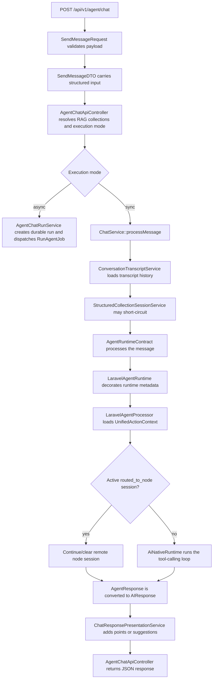
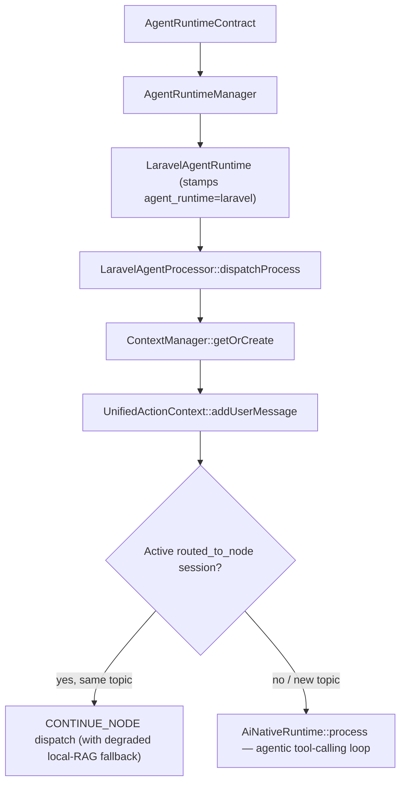
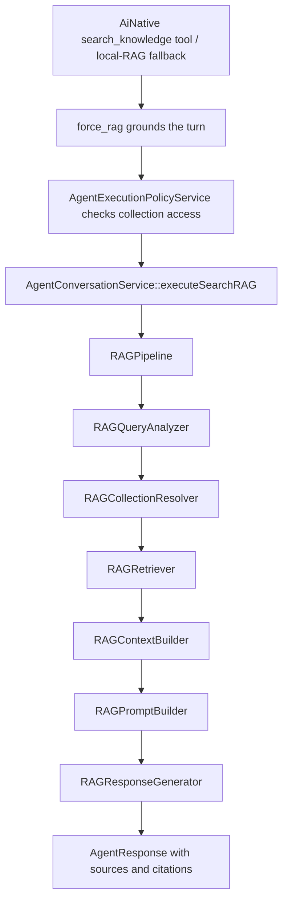

# ChatFlow Trace

ChatFlow is the package path behind `POST /api/v1/agent/chat` and `ChatService::processMessage()`. It validates the request, builds a structured chat DTO, resolves sync or async execution, delegates the turn to the configured agent runtime, records routing metadata, and returns a normalized API response.

Use this page when debugging a chat response, adding an agent tool or skill, changing RAG behavior, or checking whether a new feature belongs in the controller, service, runtime, AiNative loop, or RAG layer.

> **Runtime model (current).** The legacy multi-stage `RoutingPipeline` routing brain has been removed. `AiNativeRuntime` is now the sole router: it runs an agentic tool-calling loop and decides every turn. The only branch that runs *before* AiNative is an active federated node session (`routed_to_node`), which either continues the remote session or, on a new topic, clears it and falls through to AiNative.

## High-Level Flow



## Request Boundary

`SendMessageRequest` is the only HTTP validation boundary for the chat endpoint. It validates the public payload and creates `SendMessageDTO`.

Important request fields:

| Field | Purpose |
| --- | --- |
| `message` | User message. Required. |
| `session_id` | Conversation/session key. Required. |
| `engine` / `model` | Provider and model passed to the runtime. |
| `memory` | Enables transcript loading and persistence. |
| `actions` | Allows runtime actions/tools to be returned and executed. |
| `use_rag` | Enables RAG for the request. |
| `force_rag` | Requires the turn to be knowledge-grounded: AiNative must call the `search_knowledge` tool before returning a final answer. |
| `rag_collections` | Restricts retrieval to selected collections. |
| `search_instructions` | Adds retrieval/generation instructions. |
| `execution_mode` | `sync`, `async`, or `auto`. |
| `async` | Legacy async flag or alias for `sync`, `async`, and `auto`. |
| `collection` | Structured collection schema and callback settings. |
| `response_points_format` | `text`, `array`, `both`, or `none`. |
| `response_suggestions` | Enables suggested next actions. |

Controllers should not query models directly. If a new request field needs business logic, convert it into DTO/options data in the request/controller boundary and handle the logic in a service.

## Execution Mode

`AgentChatExecutionModeResolver` decides whether the request is handled immediately or queued as a durable agent run.

| Requested state | Result |
| --- | --- |
| `execution_mode=sync` | Always sync, with reason `explicit_sync`. |
| Async disabled in config | Sync, with reason `async_disabled`. |
| `execution_mode=async` or `async=true` | Async, with reason `explicit_async`. |
| Config default async | Async, with reason `config_async_default`. |
| No explicit mode | Sync, with reason `default_sync`. |
| `execution_mode=auto` plus goal/sub-agent | Async, with reason `goal_or_sub_agent`. |
| `execution_mode=auto` plus streaming | Async, with reason `streaming`. |
| `execution_mode=auto` plus durable collection callback | Async, with reason `structured_collection`. |
| `execution_mode=auto` plus matched skill | Async, with reason `matched_skill`. |
| `execution_mode=auto` simple chat | Sync, with reason `simple_chat`. |

Async responses return `202 Accepted` with `agent_run_id`, `status_url`, `trace_url`, `stream_url`, and broadcast metadata. Sync responses return the final chat response.

## Sync Chat Service Flow

`ChatService::processMessage()` owns the synchronous business flow.

1. Loads or creates the transcript conversation when `memory=true`.
2. Loads recent transcript history unless history is already provided.
3. Fires `AISessionStarted`.
4. Builds runtime options from engine, model, memory, actions, RAG, collections, search instructions, conversation history, forwarded-request state, and controller execution metadata.
5. Calls `StructuredCollectionSessionService::handle()`.
6. If collection handling returns an `AIResponse`, it short-circuits before the agent runtime.
7. Otherwise delegates to `AgentRuntimeContract`.
8. Converts the returned `AgentResponse` into `AIResponse`.
9. Persists the transcript turn when memory is enabled.
10. Applies response presentation for structured points and suggestions.

Runtime options are the contract between the controller/service boundary and agent runtime. Prefer adding generic options there instead of passing request objects deeper into the runtime.

## Runtime And Routing

The default runtime path is:



`LaravelAgentProcessor` owns context assembly and the single federation branch. It does not
implement a routing brain: there is no `RoutingPipeline`, no ordered `RoutingStageContract`
stages, and no message-classification/AI-router decision step. Every turn that is not an
active routed node continuation is delegated to `AiNativeRuntime`, which plans and calls
tools (RAG via `search_knowledge`, application/provider tools, sub-agents) inside its own
loop until it produces a final answer.

The federation branch is the only exception. When a prior turn routed to a remote node and
left a `routed_to_node` marker in context, `dispatchProcess`:

1. Continues the remote session (`CONTINUE_NODE`) when the new message stays on topic.
2. Falls back to a degraded **local** RAG search if the remote follow-up fails, prefixing a
   notice so the chain is observable.
3. Clears the marker and falls through to AiNative when a new topic is detected.

## Federation Routing Actions

The `RoutingDecision` DTO survives only to carry the federation handoff. AiNative is what
actually selects tools; these actions are produced by the node-session path, not a router:

| Action | Responsibility |
| --- | --- |
| `route_to_node` | Hand the turn to a configured remote node (AiNative `route_to_node` tool). |
| `continue_node` | Continue an active routed node session. |

All other capabilities — RAG retrieval, application/provider tools, sub-agents, selection
handling — are AiNative tools invoked inside its loop, gated by `AgentExecutionPolicyService`,
not pre-decided routing actions.

## Response Metadata

A successful sync response includes the rendered `data.response` plus normalized metadata.

```json
{
  "success": true,
  "data": {
    "response": "Found 2 relevant records.",
    "metadata": {
      "agent_runtime": "laravel",
      "agent_strategy": "ai_native",
      "rag_enabled": true,
      "context_count": 2,
      "sources": []
    },
    "rag_enabled": true,
    "context_count": 2,
    "sources": [],
    "session_id": "thread-123",
    "execution_mode": "sync",
    "execution_mode_reason": "explicit_sync"
  }
}
```

Metadata keys:

- `agent_runtime` is always present (`laravel`, or `langgraph` when that runtime is selected).
- `agent_strategy` is `ai_native` for turns handled by the AiNative loop.
- `routing_decision`, `routing_trace`, and `route_explanation` are emitted on the **federation
  node path** (`continue_node`) and on a degraded local-RAG fallback, where a `RoutingDecision`
  is dispatched. A plain AiNative turn does not pre-decide a route, so these keys may be
  absent — their presence is not a per-turn invariant. (The old per-stage `metadata.stage`
  field no longer exists.)

Clients should use top-level `data.response`, `data.rag_enabled`, `data.sources`, `data.response_points`, `data.suggestions`, `data.collection`, and `data.actions` for UI rendering. Use `data.metadata` (including `routing_decision`/`route_explanation` when present) for debugging and observability.

## RAG Path

RAG is reached through the AiNative `search_knowledge` tool (and the federation degraded
local-RAG fallback). Both converge on `AgentConversationService::executeSearchRAG`.



### Cost of `force_rag`

`force_rag=true` makes the turn knowledge-grounded by requiring AiNative to call
`search_knowledge` before answering. That adds cost over a plain conversational reply:

| Cost component | Plain reply | `force_rag` reply |
| --- | --- | --- |
| LLM round-trips | 1 (answer) | **≥2** (decide+emit the tool call, then answer from the result) |
| Embedding calls | 0 | 1 (embed the query for vector search) |
| Vector/graph retrieval | 0 | 1 retrieval pass (+ graph expansion if hybrid RAG is on) |
| Prompt tokens | base | base **+ retrieved context** injected into the final call |

So the dominant new cost is the **extra LLM round-trip plus the retrieved-context tokens**
on the final call — roughly a 1.5–2× token bill versus an ungrounded reply, plus one
embedding + one retrieval. Use it when grounding is required (factual/citation answers),
not for chit-chat. To reduce it: scope `rag_collections` so retrieval returns fewer/smaller
chunks, cap `RAGContextBuilder` context size, and leave `force_rag` off for turns that do
not need sources (AiNative will still call `search_knowledge` on its own when the question
warrants it). A precise token figure depends on your model, context size, and corpus —
benchmark with your own provider; the package itself makes no extra LLM calls beyond the
tool-call round-trip described here.

The routing layer never retrieves records. Collection access policy and retrieval stay inside the execution/RAG services.

## Where To Change Things

| Change | Layer |
| --- | --- |
| Add request validation | `SendMessageRequest` |
| Add structured input fields | `SendMessageDTO` and `agentOptions()` |
| Change sync/async selection | `AgentChatExecutionModeResolver` |
| Change transcript or runtime option assembly | `ChatService` |
| Add an agent capability | New AiNative tool (registered in the AiNative tool registry) or skill |
| Add federation behavior | `LaravelAgentProcessor::dispatchProcess` node branch / node-session services |
| Change RAG retrieval/generation | RAG services behind `RAGPipeline` |
| Change public JSON shape | `AgentChatApiController` and API docs |
| Change UI-friendly points/suggestions | `ChatResponsePresentationService` |

For host-app business records, keep model access in repositories/services and expose the capability through tools, actions, RAG, or collection callbacks. Do not put project-specific model queries in the package controller or runtime.

## Tests To Run

Focused chat and runtime suite:

```bash
php vendor/bin/phpunit \
  tests/Unit/Services/ChatServiceTest.php \
  tests/Unit/Services/Agent/LaravelAgentProcessorTraceAndIdempotencyTest.php \
  tests/Unit/Services/Agent/Execution/AgentExecutionDispatcherTest.php \
  tests/Feature/FlowAllFullChatFlowEndToEndTest.php
```

Full package suite:

```bash
php vendor/bin/phpunit
```

Root app validation, when available:

```bash
php artisan ai:test-everything --profile=full --root-path=/path/to/root/app --phpunit=./vendor/bin/phpunit --json
```

## Debug Checklist

When a chat turn is wrong, check these in order:

1. The request validates and `SendMessageDTO` contains expected values.
2. `execution_mode` and `execution_mode_reason` are correct.
3. `use_rag`, `force_rag`, `rag_collections`, and `search_instructions` reach runtime options.
4. Structured collection did not short-circuit unexpectedly.
5. `UnifiedActionContext` has the expected session, user, and conversation history.
6. AiNative selected the expected tools for the turn (check `agent_strategy` and any tool/run steps).
7. On the federation path, `routing_decision`/`route_explanation` show `continue_node` and any local-RAG fallback.
8. `AgentExecutionPolicyService` did not block the selected collection, tool, sub-agent, or node.
9. RAG responses include `rag_enabled`, `context_count`, and normalized `sources`.
10. Presentation did not change the response text or hide points/suggestions unexpectedly.

A plain AiNative turn does not pre-decide a route, so `routing_trace` is not expected on every response — its absence is normal. It is emitted on the federation node path and on a degraded local-RAG fallback, where it is the fastest way to see whether the turn continued a remote node session or fell back to local RAG.
